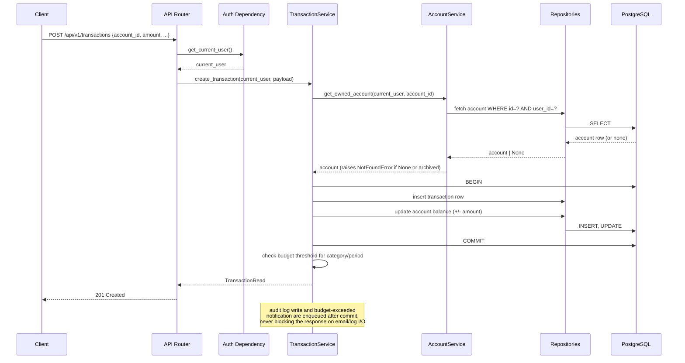
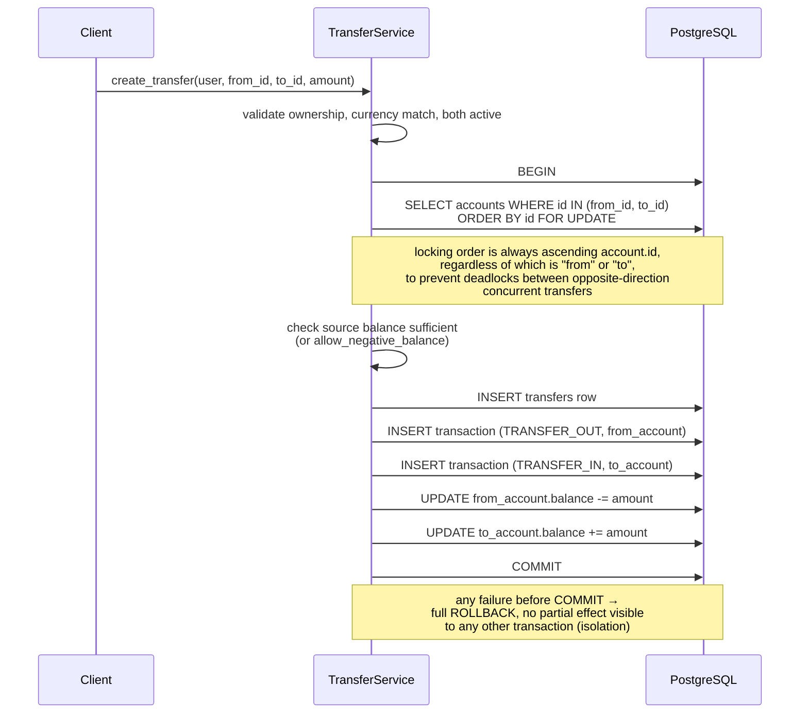
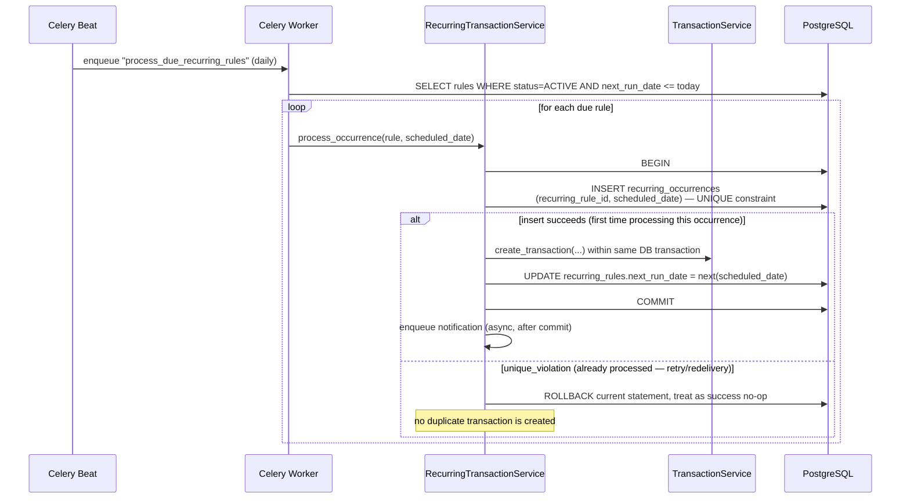
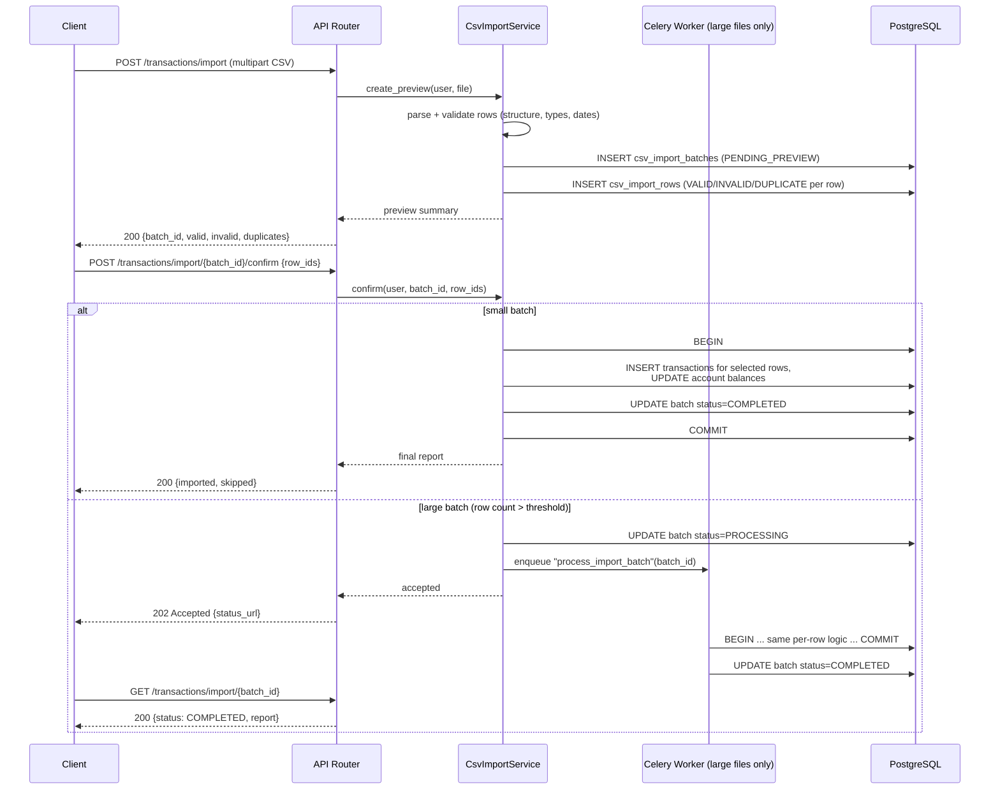
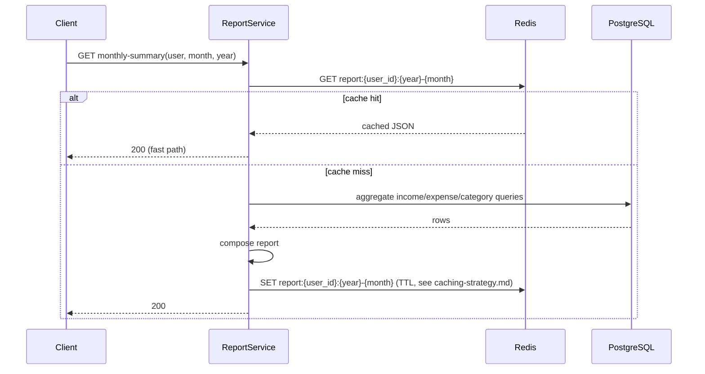
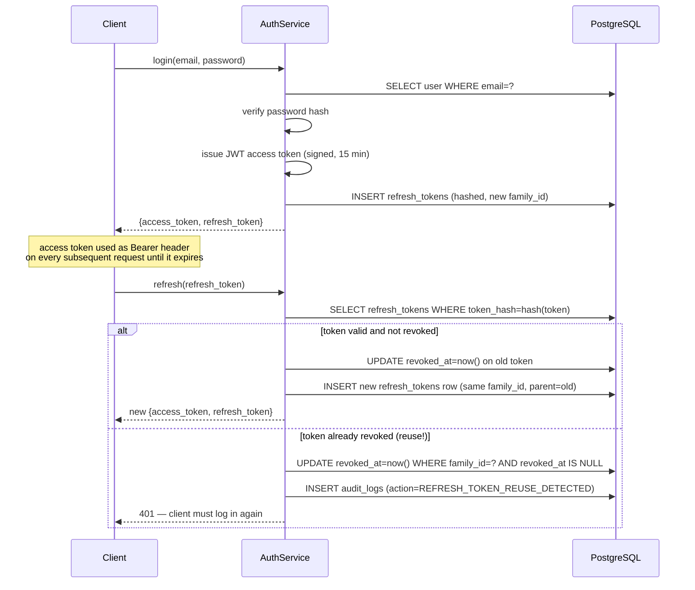

# FinTrack — Data Flow

This document traces how data moves through the system for the
highest-risk and most illustrative operations, complementing the use
cases in `05-use-cases.md` with a layer-by-layer view.

## 1. Synchronous Write: Create a Transaction (`UC-04`)

Key property: the transaction insert and the balance update happen inside
one DB transaction. If either fails, both roll back — the account balance
can never reflect a transaction that doesn't exist, or vice versa.

## 2. Synchronous Write: Transfer Between Accounts (`UC-07`)

This is the single most correctness-critical flow in the system and is
covered by a dedicated forced-failure integration test and a concurrency
test (see `05-use-cases.md` UC-07 alternate flows).

## 3. Background Flow: Recurring Transaction Processing (`UC-09`)

The uniqueness constraint on `(recurring_rule_id, scheduled_date)` — not
application-level "check then insert" logic — is what makes this safe
under retries, worker crashes, and at-least-once task redelivery. A
check-then-insert approach would have a race window; the DB constraint
does not.

## 4. Background Flow: CSV Import (`UC-10`)

The `confirm` step transitions `csv_import_batches.status` from
`PENDING_PREVIEW` → `CONFIRMED`/`PROCESSING`; a second confirm call on an
already-confirmed batch is rejected (409), preventing double-import from
a client retry.

## 5. Read Flow With Cache: Monthly Report

Cache invalidation on write: any transaction create/update/delete/void
for a given user invalidates (deletes) that user's cached report keys for
the affected month, rather than relying on TTL alone to catch up — see
`caching-strategy.md` for the full policy.

## 6. Authentication Data Flow (Token Lifecycle)

