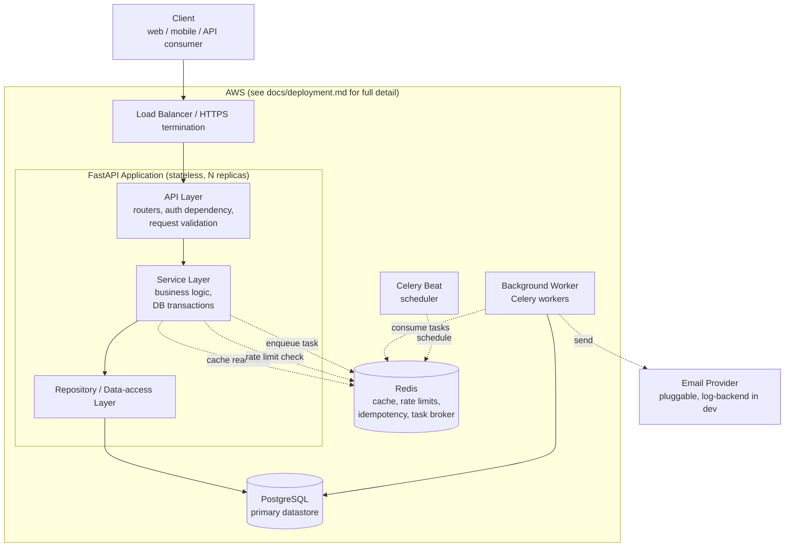

# FinTrack — System Architecture

## 1. Architectural Style: Modular Monolith

FinTrack is built as a **single deployable FastAPI application**, internally
organized into clearly bounded modules (auth, accounts, transactions,
transfers, budgets, goals, recurring, csv_import, reports, notifications,
audit, admin), each with its own router, service, repository, and schema
layer.

**Why not microservices**: the domains here are small, share one
consistent transactional boundary (a transfer touches two accounts; a
budget reads transactions; a report reads five different tables), and are
operated by a single team. Splitting them into services would require
distributed transactions or eventual consistency for operations that are
naturally atomic in one database (see `UC-07`), plus the operational
overhead of multiple deployables, service discovery, and network calls
for what are in-process function calls today. Per engineering rule 3, that
overhead is not justified here. If a specific module later has genuinely
different scaling or team-ownership needs, it can be extracted from the
modular monolith because the module boundaries already exist in code —
that is the whole point of keeping them clean now.

## 2. High-Level Component Diagram



## 3. Components and Why Each Exists

| Component | Purpose | Why it exists |
|---|---|---|
| **FastAPI application** | Serves the REST API (`/api/v1/*`), handles auth, validation, and orchestrates business logic. | The core product surface. Chosen for native async support, Pydantic-based validation, and first-class OpenAPI generation. |
| **PostgreSQL** | System of record for every entity in `docs/database-design.md`. | Strong transactional guarantees (ACID) are non-negotiable for a ledger — this is the single most important infrastructure decision in the system. |
| **Redis** | (1) cache for read-heavy, slower-changing data (reports, category list); (2) rate-limit counters; (3) idempotency-key storage; (4) Celery message broker/result backend. | Each use is justified individually in `caching-strategy.md` and `background-jobs.md` — Redis is not added speculatively (engineering rule 4). |
| **Background Worker (Celery)** | Executes recurring-transaction processing, large CSV import processing, notification dispatch, and periodic summary pre-computation. | These are operations that are either scheduled (no synchronous request to attach to) or too slow/bulk to run inline in an HTTP request. Nothing that *should* be synchronous is pushed here (engineering rule 5) — e.g., creating a single transaction is always synchronous. |
| **Celery Beat** | Triggers scheduled jobs (daily recurring-transaction sweep, periodic housekeeping). | Recurring transactions are date-driven, not event-driven; something has to wake up and check "what's due today." |
| **Load Balancer / HTTPS termination** | Distributes traffic across stateless app replicas, terminates TLS. | Enables horizontal scaling and is the standard AWS entry point (ALB) — detailed in `docs/deployment.md` at Stage 15. |
| **Email Provider (pluggable)** | Delivers email notifications. | Abstracted behind `NotificationChannel` (see `background-jobs.md` and root prompt §20) so the concrete provider (SES, SMTP, or a no-op log backend in dev/test) is swappable without touching business logic. |

## 4. Request Lifecycle (Synchronous Path)

```
Client
  │  HTTPS request, Bearer access token
  ▼
Load Balancer  ───────────────────────────────────────────
  │
  ▼
FastAPI middleware chain:
  1. Request-ID assignment/propagation
  2. Structured logging context bind
  3. Secure headers
  4. CORS
  5. Rate limiting (Redis-backed, on sensitive routes)
  ▼
Router (API layer)
  │  Pydantic request schema validation
  │  `Depends(get_current_user)` → decodes/validates JWT
  ▼
Service layer
  │  Business rules, ownership checks, orchestrates repositories
  │  Opens a DB transaction for any multi-row/ledger-affecting write
  ▼
Repository layer
  │  SQLAlchemy queries/writes, scoped by user_id
  ▼
PostgreSQL
  │
  ▼  (response bubbles back up)
Service layer → Pydantic response schema → Router → Client
```

Any unhandled domain exception raised in the service layer is caught by a
single centralized exception handler (see `security-architecture.md` and
root prompt §22) and translated into the standard error envelope —
individual routers do not each implement their own error translation.

## 5. Deployment Topology (Summary)

The application is stateless at the process level, so multiple replicas
can run behind the load balancer with no session affinity required.
PostgreSQL and Redis are run as managed services (RDS, ElastiCache) rather
than self-managed containers in production, to avoid taking on
operational burden (backups, failover) that a managed service already
solves well. Full detail, including networking, environment variable
management, and migration execution during deploys, is deferred to
`docs/deployment.md`, produced at Stage 15 — this document only asserts
the shape of the topology so the app-level architecture (module
boundaries, statelessness) is designed correctly from the start.

## 6. What This Architecture Deliberately Does Not Include

- **No API gateway product** beyond the load balancer — a single FastAPI
  app already provides routing, auth, and validation; a separate gateway
  would duplicate responsibilities for no benefit at this scale.
- **No message bus (Kafka/SNS/SQS) between "services"** — there is one
  service. Celery + Redis is sufficient for the background-job needs
  described in `background-jobs.md`.
- **No GraphQL layer** — the API surface (documented in
  `docs/api-design.md`) is resource-oriented and fits REST cleanly; adding
  GraphQL would be complexity without a corresponding requirement.
- **No separate read-replica/CQRS split** — documented as a future option
  in `03-non-functional-requirements.md` §6, not built until real load
  data justifies it.
