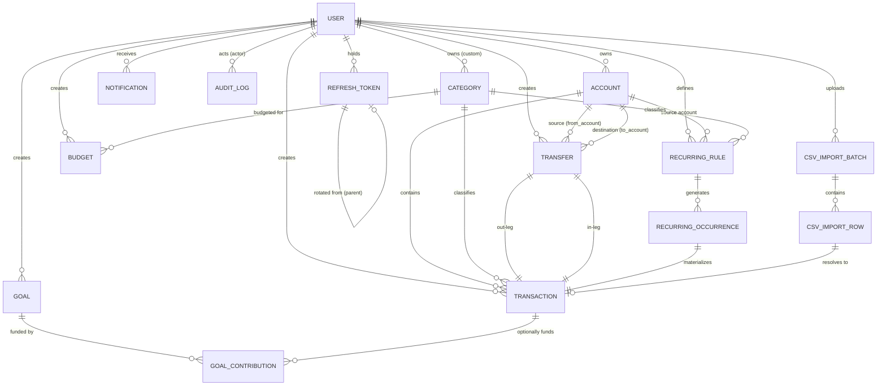

# FinTrack — Database Design

Database: **PostgreSQL 16**. ORM: **SQLAlchemy 2.x** (typed, `Mapped[...]`
style). Migrations: **Alembic**. This document is the source of truth for
schema; SQLAlchemy models and Alembic migrations (Stage 2) must match it
exactly, and any deviation found during implementation must be reflected
back into this document.

## 1. Design Principles

1. **Money is never a float.** All monetary columns are
   `NUMERIC(18, 2)` (see `docs/money-and-currency.md`-equivalent content in
   section 8 below for the full rationale). Two decimal places is correct
   for INR (paise-level precision would be `NUMERIC(18,4)` if ever needed;
   v1 standardizes on 2).
2. **The ledger is the source of truth for balances.** `accounts.balance`
   is a denormalized, always-consistent cache of
   `SUM(signed transaction amounts)` for that account, updated in the same
   DB transaction as any ledger write — never computed lazily at read time
   for the primary account list (that would not scale), but always
   reconcilable by re-summing the ledger (and a scheduled reconciliation
   job / admin tool can verify this invariant).
3. **Soft delete / archive, never hard delete, once financial history
   exists.** `is_archived` (accounts, categories) or a `status`/`is_voided`
   flag (transactions) preserves auditability. Hard deletes are only used
   for rows that were never financially consequential (e.g., a CSV import
   preview row).
4. **Every user-owned table carries `user_id` directly** (not inferred
   via joins), so authorization checks (`WHERE user_id = :current_user_id`)
   are a single indexed predicate on every query — this is a deliberate
   denormalization for security-critical simplicity and performance.
5. **Natural uniqueness is enforced at the DB level, not just in
   application code**, wherever a duplicate would be a correctness bug
   (e.g., one budget per user/category/period; one recurring transaction
   per rule/scheduled-date).
6. **Timestamps**: every table has `created_at` (server default `now()`);
   mutable tables also have `updated_at` (updated via ORM
   `onupdate`/DB trigger — decided at implementation time, documented
   either way).

## 2. Entity-Relationship Diagram

## 3. Table Definitions

### 3.1 `users`

| Column | Type | Constraints |
|---|---|---|
| id | BIGINT / UUID (PK) | |
| email | VARCHAR(255) | UNIQUE, NOT NULL |
| hashed_password | VARCHAR(255) | NOT NULL |
| full_name | VARCHAR(150) | NOT NULL |
| role | ENUM('USER','ADMIN') | NOT NULL, DEFAULT 'USER' |
| default_currency | CHAR(3) | NOT NULL, DEFAULT 'INR' |
| timezone | VARCHAR(64) | NOT NULL, DEFAULT 'Asia/Kolkata' |
| is_verified | BOOLEAN | NOT NULL, DEFAULT false |
| is_locked | BOOLEAN | NOT NULL, DEFAULT false (explicit, admin-controlled - FR-ADMIN-02) |
| failed_login_attempts | SMALLINT | NOT NULL, DEFAULT 0 |
| locked_until | TIMESTAMPTZ | NULLABLE (auto-expiring lockout from failed logins - FR-AUTH-09; added during Stage 3, distinct from `is_locked`) |
| created_at | TIMESTAMPTZ | NOT NULL, DEFAULT now() |
| updated_at | TIMESTAMPTZ | NOT NULL |

Indexes: unique index on `email` (case-insensitive — store lowercased or
use a functional index). Login is blocked while either `is_locked` is true
or `locked_until` is in the future; a successful password reset clears
both (self-service recovery path).

### 3.2 `refresh_tokens`

| Column | Type | Constraints |
|---|---|---|
| id | UUID (PK) | |
| user_id | FK → users.id | NOT NULL, indexed |
| token_hash | VARCHAR(255) | UNIQUE, NOT NULL (SHA-256 of the opaque token; raw token is never stored) |
| family_id | UUID | NOT NULL, indexed (all tokens descended from one login share this) |
| parent_id | FK → refresh_tokens.id | NULLABLE (self-reference; NULL for the token issued at login) |
| expires_at | TIMESTAMPTZ | NOT NULL |
| revoked_at | TIMESTAMPTZ | NULLABLE |
| created_by_ip | VARCHAR(64) | NULLABLE |
| created_at | TIMESTAMPTZ | NOT NULL, DEFAULT now() |

Indexes: `(family_id)`, `(user_id, revoked_at)`. Reuse detection (UC-02)
relies on: token presented → hash lookup → if `revoked_at IS NOT NULL`,
revoke everything in `family_id`.

### 3.2a `password_reset_tokens`

Added during Stage 3 implementation — the original schema pass omitted a
table for `FR-AUTH-08` (forgot-password). Same hashed-storage pattern as
`refresh_tokens`.

| Column | Type | Constraints |
|---|---|---|
| id | UUID (PK) | |
| user_id | FK → users.id | NOT NULL, indexed |
| token_hash | VARCHAR(255) | UNIQUE, NOT NULL (SHA-256 of the opaque token) |
| expires_at | TIMESTAMPTZ | NOT NULL |
| used_at | TIMESTAMPTZ | NULLABLE (single-use: set when the token is consumed) |
| created_at | TIMESTAMPTZ | NOT NULL, DEFAULT now() |

### 3.3 `accounts`

| Column | Type | Constraints |
|---|---|---|
| id | BIGINT (PK) | |
| user_id | FK → users.id | NOT NULL, indexed |
| name | VARCHAR(120) | NOT NULL |
| type | ENUM('BANK','CASH','CREDIT_CARD','SAVINGS','INVESTMENT','WALLET') | NOT NULL |
| currency | CHAR(3) | NOT NULL |
| balance | NUMERIC(18,2) | NOT NULL, DEFAULT 0 |
| allow_negative_balance | BOOLEAN | NOT NULL, DEFAULT false (auto-true for CREDIT_CARD at creation) |
| is_archived | BOOLEAN | NOT NULL, DEFAULT false |
| created_at, updated_at | TIMESTAMPTZ | NOT NULL |

Indexes: `(user_id, is_archived)`.

### 3.4 `categories`

| Column | Type | Constraints |
|---|---|---|
| id | BIGINT (PK) | |
| user_id | FK → users.id | NULLABLE (NULL = system default category, visible to all users) |
| name | VARCHAR(80) | NOT NULL |
| type | ENUM('INCOME','EXPENSE') | NOT NULL |
| is_system | BOOLEAN | NOT NULL, DEFAULT false |
| is_archived | BOOLEAN | NOT NULL, DEFAULT false |
| created_at | TIMESTAMPTZ | NOT NULL |

Constraints: `UNIQUE (COALESCE(user_id, 0), name)` — a user cannot create
two categories with the same name, and system categories are globally
unique by name.

### 3.5 `transactions`

The single ledger table. Every balance-affecting event — income, expense,
and each leg of a transfer — is one row here.

| Column | Type | Constraints |
|---|---|---|
| id | BIGINT (PK) | |
| user_id | FK → users.id | NOT NULL, indexed |
| account_id | FK → accounts.id | NOT NULL, indexed |
| category_id | FK → categories.id | NULLABLE (transfer legs may omit category) |
| type | ENUM('INCOME','EXPENSE','TRANSFER_IN','TRANSFER_OUT') | NOT NULL |
| amount | NUMERIC(18,2) | NOT NULL, CHECK (amount > 0) — sign is derived from `type`, never stored negative |
| currency | CHAR(3) | NOT NULL |
| description | VARCHAR(255) | NOT NULL |
| merchant | VARCHAR(150) | NULLABLE |
| notes | TEXT | NULLABLE |
| transaction_date | DATE | NOT NULL, indexed |
| transfer_id | FK → transfers.id | NULLABLE (set only for TRANSFER_IN/TRANSFER_OUT rows) |
| recurring_occurrence_id | FK → recurring_occurrences.id | NULLABLE |
| is_voided | BOOLEAN | NOT NULL, DEFAULT false (soft delete) |
| created_at, updated_at | TIMESTAMPTZ | NOT NULL |

Indexes: `(user_id, transaction_date)`, `(account_id, transaction_date)`,
`(user_id, category_id, transaction_date)` (supports budget/report
aggregation), `(transfer_id)`.

Balance sign convention: `INCOME` and `TRANSFER_IN` credit the account
(+amount); `EXPENSE` and `TRANSFER_OUT` debit it (-amount).

### 3.6 `transfers`

The atomic parent record linking two `transactions` rows (one per
account). Kept as its own table (rather than only two `Transaction` rows)
so transfer history (`FR-XFER-04`, `US-XFER-03`) can be queried directly
without pairing logic.

| Column | Type | Constraints |
|---|---|---|
| id | BIGINT (PK) | |
| user_id | FK → users.id | NOT NULL, indexed |
| from_account_id | FK → accounts.id | NOT NULL |
| to_account_id | FK → accounts.id | NOT NULL, CHECK (to_account_id <> from_account_id) |
| amount | NUMERIC(18,2) | NOT NULL, CHECK (amount > 0) |
| currency | CHAR(3) | NOT NULL |
| description | VARCHAR(255) | NULLABLE |
| transfer_date | DATE | NOT NULL |
| created_at | TIMESTAMPTZ | NOT NULL |

### 3.7 `budgets`

| Column | Type | Constraints |
|---|---|---|
| id | BIGINT (PK) | |
| user_id | FK → users.id | NOT NULL, indexed |
| category_id | FK → categories.id | NOT NULL |
| period_month | SMALLINT | NOT NULL, CHECK (1–12) |
| period_year | SMALLINT | NOT NULL |
| target_amount | NUMERIC(18,2) | NOT NULL, CHECK (target_amount > 0) |
| currency | CHAR(3) | NOT NULL |
| created_at, updated_at | TIMESTAMPTZ | NOT NULL |

Constraints: `UNIQUE (user_id, category_id, period_month, period_year)`
— enforces `FR-BUDG` "one budget per category per period" at the DB level.

### 3.8 `goals`

| Column | Type | Constraints |
|---|---|---|
| id | BIGINT (PK) | |
| user_id | FK → users.id | NOT NULL, indexed |
| name | VARCHAR(120) | NOT NULL |
| target_amount | NUMERIC(18,2) | NOT NULL, CHECK (target_amount > 0) |
| current_amount | NUMERIC(18,2) | NOT NULL, DEFAULT 0, CHECK (current_amount >= 0) |
| currency | CHAR(3) | NOT NULL |
| target_date | DATE | NOT NULL |
| status | ENUM('ACTIVE','ACHIEVED','CLOSED') | NOT NULL, DEFAULT 'ACTIVE' |
| created_at, updated_at | TIMESTAMPTZ | NOT NULL |

### 3.9 `goal_contributions`

| Column | Type | Constraints |
|---|---|---|
| id | BIGINT (PK) | |
| goal_id | FK → goals.id | NOT NULL, indexed |
| amount | NUMERIC(18,2) | NOT NULL, CHECK (amount > 0) |
| source_transaction_id | FK → transactions.id | NULLABLE |
| source_account_id | FK → accounts.id | NULLABLE |
| contributed_at | DATE | NOT NULL |
| created_at | TIMESTAMPTZ | NOT NULL |

### 3.10 `recurring_rules`

| Column | Type | Constraints |
|---|---|---|
| id | BIGINT (PK) | |
| user_id | FK → users.id | NOT NULL, indexed |
| account_id | FK → accounts.id | NOT NULL |
| category_id | FK → categories.id | NULLABLE |
| type | ENUM('INCOME','EXPENSE') | NOT NULL |
| amount | NUMERIC(18,2) | NOT NULL, CHECK (amount > 0) |
| currency | CHAR(3) | NOT NULL |
| description | VARCHAR(255) | NOT NULL |
| frequency | ENUM('DAILY','WEEKLY','MONTHLY','YEARLY') | NOT NULL |
| interval | SMALLINT | NOT NULL, DEFAULT 1, CHECK (interval > 0) |
| start_date | DATE | NOT NULL |
| end_date | DATE | NULLABLE |
| next_run_date | DATE | NOT NULL, indexed |
| status | ENUM('ACTIVE','PAUSED','ENDED') | NOT NULL, DEFAULT 'ACTIVE' |
| created_at, updated_at | TIMESTAMPTZ | NOT NULL |

Indexes: `(status, next_run_date)` — the worker's due-rule query.

### 3.11 `recurring_occurrences`

The idempotency anchor for Stage 7 / `UC-09`.

| Column | Type | Constraints |
|---|---|---|
| id | BIGINT (PK) | |
| recurring_rule_id | FK → recurring_rules.id | NOT NULL |
| scheduled_date | DATE | NOT NULL |
| transaction_id | FK → transactions.id | NOT NULL |
| processed_at | TIMESTAMPTZ | NOT NULL |

Constraints: **`UNIQUE (recurring_rule_id, scheduled_date)`** — this is
the constraint that makes recurring processing idempotent; a duplicate
insert for the same occurrence fails at the DB level and is caught and
treated as a no-op by the worker.

### 3.12 `csv_import_batches`

| Column | Type | Constraints |
|---|---|---|
| id | UUID (PK) | |
| user_id | FK → users.id | NOT NULL, indexed |
| filename | VARCHAR(255) | NOT NULL |
| status | ENUM('PENDING_PREVIEW','CONFIRMED','PROCESSING','COMPLETED','FAILED') | NOT NULL |
| total_rows | INTEGER | NOT NULL, DEFAULT 0 |
| imported_rows | INTEGER | NOT NULL, DEFAULT 0 |
| skipped_rows | INTEGER | NOT NULL, DEFAULT 0 |
| error_report | JSONB | NULLABLE |
| created_at, updated_at | TIMESTAMPTZ | NOT NULL |

### 3.13 `csv_import_rows`

| Column | Type | Constraints |
|---|---|---|
| id | BIGINT (PK) | |
| batch_id | FK → csv_import_batches.id | NOT NULL, indexed |
| row_number | INTEGER | NOT NULL |
| raw_data | JSONB | NOT NULL |
| status | ENUM('VALID','INVALID','DUPLICATE','IMPORTED','SKIPPED') | NOT NULL |
| error_message | VARCHAR(500) | NULLABLE |
| resolved_transaction_id | FK → transactions.id | NULLABLE |

These rows are working data for one import batch; they may be pruned by a
retention job after a batch is finalized (documented, not built in v1).

### 3.14 `notifications`

| Column | Type | Constraints |
|---|---|---|
| id | BIGINT (PK) | |
| user_id | FK → users.id | NOT NULL, indexed |
| type | VARCHAR(64) | NOT NULL (e.g. `BUDGET_EXCEEDED`, `GOAL_ACHIEVED`) |
| title | VARCHAR(150) | NOT NULL |
| message | VARCHAR(500) | NOT NULL |
| is_read | BOOLEAN | NOT NULL, DEFAULT false |
| metadata | JSONB | NULLABLE |
| created_at | TIMESTAMPTZ | NOT NULL, indexed |

### 3.15 `notification_preferences`

| Column | Type | Constraints |
|---|---|---|
| id | BIGINT (PK) | |
| user_id | FK → users.id | NOT NULL |
| type | VARCHAR(64) | NOT NULL |
| channel | ENUM('IN_APP','EMAIL') | NOT NULL |
| is_enabled | BOOLEAN | NOT NULL, DEFAULT true |

Constraints: `UNIQUE (user_id, type, channel)`.

### 3.16 `audit_logs`

Append-only.

| Column | Type | Constraints |
|---|---|---|
| id | BIGINT (PK) | |
| user_id | FK → users.id | NULLABLE (NULL for system/worker-initiated actions) |
| action | VARCHAR(64) | NOT NULL (e.g. `LOGIN`, `TRANSACTION_CREATED`) |
| entity_type | VARCHAR(64) | NULLABLE |
| entity_id | VARCHAR(64) | NULLABLE |
| metadata | JSONB | NULLABLE (non-sensitive context only) |
| ip_address | VARCHAR(64) | NULLABLE |
| request_id | VARCHAR(64) | NULLABLE |
| created_at | TIMESTAMPTZ | NOT NULL, indexed |

Indexes: `(user_id, created_at)`, `(entity_type, entity_id)`.

## 4. Soft Deletion / Archival Strategy

| Entity | Mechanism | Rationale |
|---|---|---|
| Account | `is_archived` flag | Preserve historical transactions referencing it. |
| Category (custom) | `is_archived` flag | Preserve historical transactions/budgets referencing it. |
| Transaction | `is_voided` flag; a void reverses the balance effect via a corresponding adjustment in the same DB transaction | Preserves a full audit trail — a deleted transaction still explains a past balance change. |
| Goal | `status = CLOSED` | User may close a goal without losing contribution history. |
| Recurring rule | `status = ENDED` (via explicit delete-of-rule action) | Already-generated transactions and occurrences are untouched. |
| Refresh token | `revoked_at` timestamp | Needed for reuse-detection auditing. |
| Audit log, recurring occurrence, notification | Hard rows, never deleted | These are themselves the historical record. |

Nothing in the system performs a hard delete of a row that has ever
affected a balance or represents a historical fact.

## 5. Money Representation (see also NFR-Security/Reliability)

- Column type: `NUMERIC(18, 2)` in PostgreSQL, mapped to Python
  `decimal.Decimal` via SQLAlchemy — never `float`/`Float`.
- All arithmetic in the service layer uses `Decimal`; conversion from
  request JSON (which Pydantic parses as `Decimal` when the schema field
  is typed `Decimal`, not `float`) happens once at the API boundary.
- Rounding: standard half-up rounding to 2 decimal places applied only at
  the point of persistence/display; intermediate calculations (e.g., goal
  required-monthly-contribution) keep full `Decimal` precision until the
  final rounding step, using `ROUND_HALF_UP` via
  `Decimal.quantize()`.
- Currency is stored alongside every amount (`CHAR(3)`, ISO 4217). v1
  ships with `INR` exercised end-to-end; the column is not constrained to
  a single value so additional currencies are a data-only addition, not a
  schema change. Cross-currency arithmetic (e.g., aggregating balances
  across accounts of different currencies into one "net worth" number) is
  explicitly out of scope for v1 — `FR-XFER-03` blocks cross-currency
  transfers, and reporting aggregates per-currency, not into one blended
  total.

## 6. Concurrency & Locking

- Transfers (`UC-07`) and any transaction write that mutates
  `accounts.balance` acquire a row lock on the affected account(s) via
  `SELECT ... FOR UPDATE` inside the enclosing DB transaction.
- When a transfer locks two accounts, it always locks them in a
  consistent global order (e.g., ascending `account.id`) to prevent
  deadlocks between two concurrent transfers that touch the same pair of
  accounts in opposite directions.
- Recurring processing relies on the `UNIQUE (recurring_rule_id,
  scheduled_date)` constraint rather than an explicit lock — a constraint
  violation is treated as "someone else already processed this" and is a
  planned, not exceptional, code path.

## 7. Migration Strategy

- Alembic autogenerate is used as a starting point for each migration but
  every generated migration is hand-reviewed before commit (autogenerate
  does not reliably capture `CHECK` constraints or partial/functional
  indexes).
- Every migration must have a working `downgrade()`.
- Stage 2's acceptance criterion is that `alembic upgrade head` against an
  empty database produces the entire schema above with no manual
  intervention.
